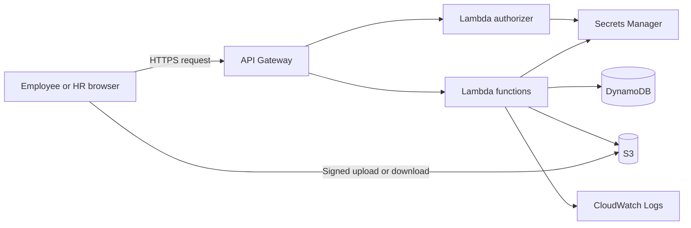

# AWS Architecture

## Purpose

This document explains which AWS services the Employee Management and
Onboarding System uses and what each one does in the project.

It does not contain passwords, tokens, account IDs, live URLs, secret values,
or generated AWS resource names. [`template.yaml`](../template.yaml) is the
source of truth for the deployed infrastructure.

## System overview

The frontend is made from static HTML, CSS, and JavaScript. It calls a
serverless backend deployed to AWS.



The AWS stack contains:

- one API Gateway REST API;
- 27 Lambda functions, including one authorizer;
- three DynamoDB tables;
- one private S3 bucket;
- two Secrets Manager secrets;
- IAM roles and permissions for the Lambda functions; and
- CloudWatch logs created for Lambda executions.

The frontend is not hosted by this AWS stack.

## AWS services used

| Service | Simple definition | How this project uses it |
|---|---|---|
| AWS SAM and CloudFormation | Tools for defining and deploying AWS resources from a file. | Build and deploy everything described in `template.yaml` as one stack. |
| Amazon API Gateway | A managed entry point for HTTP APIs. | Receives browser requests, checks authorization, applies CORS and login limits, and invokes Lambda. |
| AWS Lambda | Runs backend code without a permanent server. | Handles login, employee records, onboarding, staff management, documents, and attendance. |
| Amazon DynamoDB | A managed NoSQL database. | Stores onboarding records, active staff, and attendance. |
| Amazon S3 | Managed file storage. | Privately stores employee documents. |
| AWS Secrets Manager | Secure storage for sensitive values. | Stores the token-signing key and password hash data. |
| AWS IAM | Controls which AWS resources a function may access. | Gives each Lambda only the permissions needed for its work. |
| Amazon CloudWatch Logs | Stores application and service logs. | Records Lambda output and errors for troubleshooting. |

## API Gateway

API Gateway is the public entry point for the backend. It maps 26 HTTP routes
to Lambda functions.

It provides:

- routing by HTTP method and path;
- a public login route;
- token checks through the Lambda authorizer for other routes;
- CORS support for approved frontend origins;
- a login limit of five requests per second with a burst of ten; and
- browser-readable error responses.

CORS does not replace authentication. It only controls which browser origins
may read API responses.

## Lambda functions

The stack has 27 Python 3.13 Lambda functions. Each function has one clear job.
They use the shared code under `src/common/` for validation, database access,
authentication, and response formatting.

### Authentication

| Function | Route or trigger | What it does |
|---|---|---|
| `LoginFunction` | `POST /login` | Checks the supplied login against password hash data and returns a signed token. It has no DynamoDB access. |
| `AuthorizerFunction` | Protected API requests | Validates the token and passes the verified username, role, and employee ID to the requested function. |

### Onboarding and employee profiles

| Function | Route | What it does |
|---|---|---|
| `ListEmployeesFunction` | `GET /employees` | Returns active onboarding records for HR. |
| `CreateEmployeeFunction` | `POST /employees` | Creates an onboarding record with its initial checklist. |
| `GetEmployeeFunction` | `GET /employees/{id}` | Returns one person from the onboarding or staff table, subject to role access. |
| `UpdateEmployeeFunction` | `PUT /employees/{id}` | Updates the HR-owned fields of an active onboarding record. |
| `DeleteEmployeeFunction` | `DELETE /employees/{id}` | Archives an onboarding record instead of permanently deleting it. |
| `UpdateOwnContactFunction` | `PATCH /employees/{id}/contact` | Lets an employee update only their own allowed contact fields. |
| `SetChecklistItemFunction` | `PATCH /employees/{id}/checklist/{itemId}` | Updates the completion state or comment of one checklist item. |

### Employee documents

| Function | Route | What it does |
|---|---|---|
| `GetDocumentsFunction` | `GET /employees/{id}/documents` | Shows which document slots contain files and returns temporary download links. |
| `RequestDocumentUploadFunction` | `POST /employees/{id}/documents/{slot}` | Returns a temporary S3 upload form for one allowed document slot. The file does not pass through Lambda. |

### Staff promotion and manager assignment

| Function | Route | What it does |
|---|---|---|
| `PromoteToEmployeeFunction` | `POST /staff/employees` | Copies completed onboarding data into the staff table as an employee. |
| `PromoteToInternFunction` | `POST /staff/interns` | Copies completed onboarding data into the staff table as an intern with a manager. |
| `AddManagerInternFunction` | `POST /staff/employees/{id}/interns` | Adds an intern to a manager without creating duplicate links. |
| `RemoveManagerInternFunction` | `DELETE /staff/employees/{id}/interns/{internId}` | Removes an intern from a manager. |
| `SetInternManagerFunction` | `PUT /staff/interns/{id}/manager` | Changes an intern's reporting manager. |
| `DeleteOnboardingRecordFunction` | `DELETE /onboarding/{id}` | Removes the onboarding copy after confirming that the staff copy exists. |
| `RestoreOnboardingFunction` | `POST /onboarding/restore` | Restores a recently promoted person to onboarding when a promotion is undone. |
| `DeleteStaffEmployeeFunction` | `DELETE /staff/employees/{id}` | Removes the employee staff copy after the onboarding copy has been restored. |
| `DeleteStaffInternFunction` | `DELETE /staff/interns/{id}` | Removes the intern staff copy after the onboarding copy has been restored. |
| `ListStaffEmployeesFunction` | `GET /staff/employees` | Returns staff records whose type is employee. |
| `ListInternsFunction` | `GET /staff/interns` | Returns all interns or only the interns assigned to one manager. |

Promotion and undo operations use several small requests. The copy or restore
is created before the old record is removed so that an interrupted operation
does not leave the person with no record.

### Attendance

| Function | Route | What it does |
|---|---|---|
| `UpsertOwnAttendanceFunction` | `PUT /attendance/me/today` | Lets an employee mark or change their own attendance for today between 8:30 AM and 6:00 PM Asia/Kolkata. |
| `GetOwnAttendanceFunction` | `GET /attendance/me` | Returns the signed-in employee's monthly attendance. |
| `GetAttendanceSheetFunction` | `GET /attendance/sheet` | Returns the HR monthly attendance table for all employees. |
| `DownloadAttendanceCsvFunction` | `GET /attendance/sheet.csv` | Downloads the HR monthly attendance table as CSV. |
| `UpdateEmployeeAttendanceFunction` | `PUT /attendance/{employeeId}/{date}` | Allows HR to create or correct attendance for any existing employee and valid date. |

Attendance is intentionally simple: checked is `present`, and unchecked is
`leave`. A past applicable day without a stored attendance record is also shown
as leave.

## DynamoDB tables

All three tables use on-demand billing, so the project does not reserve database
capacity in advance.

### Onboarding table

Stores people who are still in onboarding. One item contains the employee
profile and its checklist.

- Primary key: `employeeKey`
- Main uses: create, view, edit, archive, restore, and complete onboarding

### Employee table

Stores onboarded employees and interns. The `entityType` field distinguishes
the two record types.

- Primary key: `employeeKey`
- `ByReportingManager` index: finds interns assigned to a manager
- Main uses: staff lists, promotions, manager links, and employee lookup

### Attendance table

Stores one explicit attendance declaration per employee and date.

- Partition key: `employeeKey`
- Sort key: `attendanceDate`
- `AttendanceByMonth` index: builds the HR monthly sheet and CSV export
- Stored values: `present` or `leave`, plus employee name, role, and department
  snapshots

The application uses direct item reads and writes, updates selected fields,
queries indexes for known groups, and scans only when HR needs a complete list.

Point-in-time recovery is currently disabled. Deleting the CloudFormation stack
also deletes the tables, so the current settings must be reviewed before using
real production data.

## S3 document storage

S3 stores employee documents in a private bucket. The bucket has:

- public access blocked;
- S3-managed AES-256 encryption;
- approved-origin CORS rules;
- no object ACLs; and
- no file version history.

For uploads, Lambda returns a short-lived signed form. The browser uploads the
file directly to S3, and the form limits the object location and maximum file
size. Downloads also use short-lived signed links. The bucket remains private.

The bucket must be emptied before deleting the stack because CloudFormation
cannot delete a bucket that still contains files.

## Secrets Manager

Secrets Manager stores two values:

- a randomly generated key used to sign and verify login tokens; and
- password salt and hash data used by the login function.

The account secret starts with a value that cannot authenticate anyone. An
authorized setup script adds the real password hash data after the first
deployment.

Only the login function can read both secrets. The authorizer can read only the
token-signing secret. Other functions cannot read either secret, and secret
values are not stored in Lambda environment variables or this repository.

Changing the signing secret invalidates existing tokens after the short Lambda
and API Gateway caches refresh, with a worst-case delay of about two minutes.

## IAM permissions

SAM creates a separate AWS role for each Lambda. Each role contains only the
database, file, or secret permissions needed by that function.

Examples:

- employee list functions can read only the required table;
- attendance functions can access the attendance table and required employee
  records;
- the upload function can write only to the employee document location;
- the document-list function can inspect and read document objects; and
- only login and authorization functions can read secrets.

Application roles such as employee and HR are not AWS users. They are values in
signed application tokens and never receive AWS credentials.

## CloudWatch Logs

Lambda automatically writes execution output and errors to CloudWatch Logs.
Each function has separate logs, which helps identify the route that failed.

The stack does not currently define custom log retention, dashboards, alarms,
or tracing. These should be added before production use, together with rules
that prevent personal or secret data from being written to logs.

## Deployment

AWS SAM packages the Lambda code and asks CloudFormation to create or update the
stack.

```text
sam validate --lint
sam build
sam deploy
```

The deployment accepts:

- `Stage`, which separates development and production API stages; and
- `AllowedOrigins`, which lists the frontend origins allowed to call the API and
  upload to S3.

CloudFormation generates the physical table and bucket names. The stack outputs
provide the API URL, table names, bucket name, and secret identifiers when an
authorized operator or setup script needs them. These generated values should
not be copied into this document.

## Not currently used

The current stack does not deploy Cognito, SNS, SQS, EventBridge, WAF,
CloudFront, Amplify Hosting, RDS, Aurora, or customer-managed KMS keys. These
services should not be treated as part of the project unless they are added to
`template.yaml`.

## Related documents

- [API reference](api.md)
- [Database design](database-design.md)
- [Application design](design.md)
- [Testing guide](phase3-testing.md)
